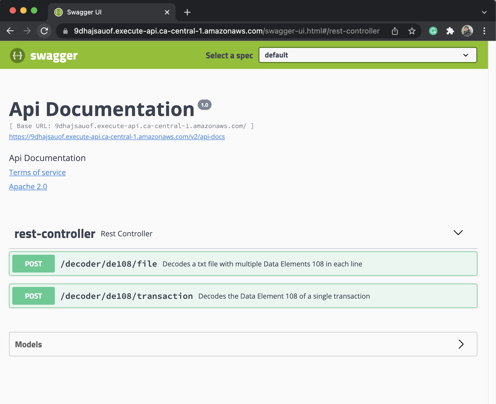

# ISO 8583 Decoder
ISO 8583 Decoder is a microservice with two APIs for decoding the Data Element 108 of the ISO 8583 specification.

## Languages and Frameworks
- Java 11
- Spring Boot Framework 2.5.2
- Lombok
- JUnit
- Swagger 2

## Libraries
- [Java Fluent Validator](https://github.com/mvallim/java-fluent-validator)
- [EMV QR Code](https://github.com/mvallim/emv-qrcode)

## Documentation
The documentation for the ISO 8583 Decoder is available online through the Swagger interface at [http://localhost:8080/swagger-ui.html](http://localhost:8080/swagger-ui.html). Below you can find details on how you can build and run this
microservice locally.

## Introduction
The ISO 8583 Decoder is a message decoder for the ISO 8383 protocol. Currently, it only supports data element 108. However,
developers can extend this application to process other data elements. It is capable of decoding LLLVAR data elements encoded with TLV (Tag-Length-Value).

## System Design
ISO 8583 Decoder is a Java microservice built using the Spring boot web framework. I used the [Java Fluent Validator](https://github.com/mvallim/java-fluent-validator)
library for performing business logic validator. This microservice was created using
SOLID concepts and DDD. There are 27 unit tests in total, and some of them were created using TDD.

## Build and Run
You can run the ISO 8583 Decoder either with Docker or Maven (Maven is a build automation tool used for Java projects).

### Docker
Open a terminal and go to the `app` directory with the `Dockerfile`. Now build the container image using the docker `build command` command:
````shell
 docker build -t iso8583-decoder .
````
Now that we have the docker image, let’s run the application. To do so, use the docker run command:
````shell
 docker run -p 8080 iso8583-decoder 
````
After a few seconds, open your web browser to [http://localhost:8080/swagger-ui.html](http://localhost:8080/swagger-ui.html).
You should be able to see the ISO 8583 Decoder Swagger interface and start to play with it.

### Maven
Open a terminal and go to the `app` directory and run:
````shell
mvn clean package
````
Now that we have the `jar` package, let’s run the application. To do so, use the `java` run command inside the `target` folder:
````shell
java -jar iso8583-decoder-0.0.1-SNAPSHOT.jar
````
After a few seconds, open your web browser to [http://localhost:8080/swagger-ui.html](http://localhost:8080/swagger-ui.html).
You should be able to see the ISO 8583 Decoder Swagger interface and start to play with it.

## APIs
There are two endpoints to chose from. The first one is the `/decoder/de108/file` which is used to upload a `TXT` file with multiple transactions
to the server. The output is a `JSON` response with the parsed data elements. The second API receives a single transaction as a
parameter and outputs its `JSON` representation. Here you can use the web interface to try out the endpoints.



### Single Transaction
#### Example Input:
```shell
curl -i -XPOST "https://9dhajsauof.execute-api.ca-central-1.amazonaws.com/decoder/de108/transaction?dataElement108=14701600104EMMA0207ANTHONY0306VAUGHN0507MACHIAS0602VI1110174609308702630106BRENDA0209ANNABELLE0307MCGUIRE0505DATIL0602MO111012544681890312030203050204"
```
#### Example Successful Output:
```json
{
  "receiver": {
    "first": "EMMA",
    "middle": "ANTHONY",
    "last": "VAUGHN",
    "city": "MACHIAS",
    "state": "VI",
    "account": "1746093087"
  },
  "sender": {
    "first": "BRENDA",
    "middle": "ANNABELLE",
    "last": "MCGUIRE",
    "city": "DATIL",
    "state": "MO",
    "account": "1254468189"
  },
  "referenceData": {
    "fundingSource": "03",
    "transactionPurpose": "04"
  }
}
```
#### Example Business Error Output:
```json
{
  "valid": false,
  "errors": [
   {
     "message": "Transaction cannot be completed since it is for crypto purpose",
     "field": "ReferenceData",
     "attemptedValue": {},
     "code": null
   }
  ]
}
```
### Multiple Transactions Using a Batch File
Alternatively, you can send a `TXT` file the the `/decoder/de108/file` endpoint and expect a collection of `JSON` objects.

## Author
* [Jaime Dantas](https://jaimedantas.com/) - _Initial work, development, test, documentation_
